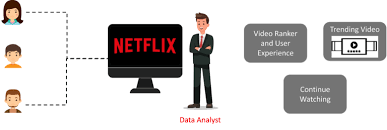
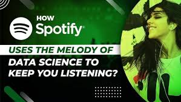

# Data Science in Entertainment: Lights, Camera, Algorithms!

## Introduction: When Data Meets Showbiz  

Have you ever wondered how Netflix knows exactly what you want to watch next, or how Spotify creates your perfect playlist? That’s the magic of data science in entertainment. It’s not just about crunching numbers; it’s about crafting personalized experiences that make us binge-watch, sing along, or stay hooked to our favorite games.  

Let’s dive into the world where data science meets the spotlight, and explore how algorithms are transforming the entertainment industry.

## 1. Personalized Recommendations

### A. The Netflix Effect 

Netflix’s recommendation engine isn’t just a convenience; it’s a work of art powered by collaborative filtering, content-based filtering, and deep learning.  
- Collaborative Filtering: Recommends shows based on what others with similar tastes are watching.  
- Content-Based Filtering: Analyzes genres, actors, and themes to suggest similar content.  

Fun Fact: Over 80% of Netflix views are driven by recommendations!  

### B. Spotify’s Musical Genius

Spotify doesn’t just suggest songs; it builds a personal soundscape for every user.  
- Natural Language Processing (NLP): Analyzes song lyrics and reviews to match your vibe.  
- Audio Analysis: Breaks songs into tempo, pitch, and beats per minute (BPM) to create playlists like *Discover Weekly*.  

Real-World Impact: Spotify’s recommendation system boosts user engagement by over 30%.

## 2. Box Office Predictions: Data Behind the Blockbusters

Before the first ticket is sold, data science predicts whether a movie will be a flop or a blockbuster.  

### How It Works  
1. Historical Data: Analyzing past box office earnings, genre trends, and seasonal patterns.  
2. Sentiment Analysis: Using NLP to gauge audience excitement from trailers and social media buzz.  
3. Machine Learning Models: Predicting opening weekend earnings based on cast, budget, and marketing reach.  

Case Study: Predicting Marvel’s *Avengers: Endgame* would surpass $1 billion in its first weekend—spot on!

## 3. Gaming Analytics: Leveling Up the Experience 

Gaming is no longer just about playing; it’s about personalized, immersive experiences powered by data.  

### A. Player Behavior Modeling

- Clustering Algorithms: Group players by behavior—casual gamers, high spenders, or competitive players.  
- Retention Strategies: Predicting when a player might drop off and sending targeted offers to keep them engaged.  

### B. Real-Time Analytics 

Games like Fortnite and Call of Duty use real-time data to:  
- Optimize matchmaking for balanced competition.  
- Identify and ban cheaters using anomaly detection algorithms.  

Fun Fact: Epic Games processes over 2 petabytes of data daily to improve gameplay.  

## 4. The Future of Data Science in Entertainment  

1. AI-Generated Content: Imagine AI creating scripts, soundtracks, and even virtual actors tailored to audience preferences.  
2. Immersive Storytelling: Using AR and VR to create personalized stories where viewers become the protagonists.  
3. Sentiment-Driven Content: Movies and songs dynamically changing based on your mood, tracked through wearables or devices.  

## 5. Challenges: The Dark Side of the Spotlight  

1. Privacy Concerns: With so much personal data being collected, maintaining user trust is critical.  
2. Algorithmic Bias: Ensuring diverse and inclusive recommendations instead of reinforcing existing biases.  
3. Overpersonalization: Balancing discovery with curation so users don’t miss out on unexpected gems.

## Conclusion: Where Art Meets Algorithms  

Data science has turned entertainment into an experience that’s personal, predictive, and magical. From the playlists that understand your mood to the games that adapt to your skills, it’s an era where creativity and computation come together.  

The future of entertainment is not just about watching or listening; it’s about living the experience – and data science is leading the way.  
