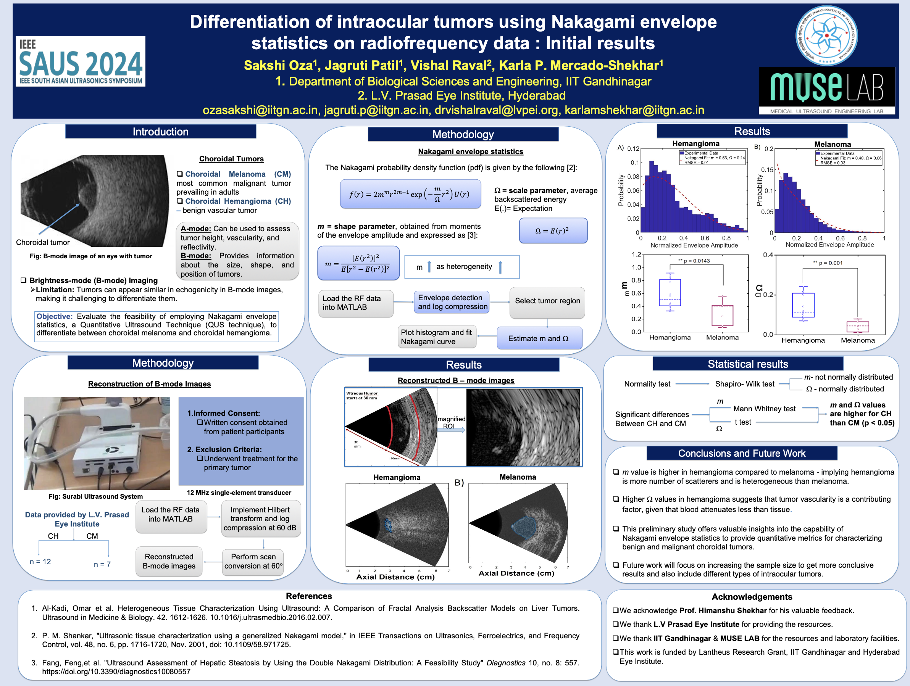

# Differentiation of Intraocular Tumors using Nakagami Envelope Statistics on Radiofrequency (RF) Data

## Background/Motivation/Objective

Ultrasonography is widely used to evaluate intraocular tumors and detect extraocular extension.  
- A-scan ultrasonography helps determine tumor height, vascularity, and reflectivity.  
- B-scan ultrasonography provides tumor size, shape, and location information.  

Despite their utility, conventional imaging has limitations in thoroughly characterizing tissues and differentiating tumor types.  

Quantitative Ultrasound (QUS) enables assessment of the intrinsic properties of tissue, leading to improved characterization.  

### Goal 

To evaluate the feasibility of using Nakagami envelope statistics, a QUS technique, to differentiate between:  
1. Malignant Choroidal Melanoma (CM)
2. Benign Choroidal Hemangioma (CH) 

These tumors are common in the eye, and distinguishing between them poses a diagnostic challenge, particularly in patients with atypical findings.

## Statement of Contribution/Method

- Participants:  
   - 9 patients: 3 with CM and 6 with CH.  
   - Approved by the institutional review board; all patients provided written consent.  

- Data Acquisition:  
   - Backscattered RF data were collected using a portable research ultrasound system with a 12 MHz motorized single-element transducer.

- Nakagami Parameters:  
   - m: Related to tissue heterogeneity and number of scatterers.  
   - Ω: Related to the average backscattered signal.  

The parameters were extracted from the echo envelope for further analysis.

## Results/Discussion 

### Key Observations 

1. Significant Differences in Ω (p < 0.05):  
   - CH had higher Ω values compared to CM.  
   - Indicates a broader range of amplitudes in CH, likely due to increased backscattered signals.  

2. No Significant Differences in m (p > 0.05):  
   - Heterogeneity (m) values were similar between CM and CH.

### Implications

- Higher Ω in CH may be due to its greater vascularity and tissue heterogeneity compared to CM.  
- Higher acoustic attenuation in CM aligns with its structural differences.  

These findings highlight the potential of Nakagami parameters for:  
- Differentiating benign and malignant choroidal tumors.  
- Informing therapeutic interventions and clinical decisions.  

## Conclusion 

This study demonstrates the feasibility of using Nakagami envelope statistics to differentiate choroidal melanomas (CM) from choroidal hemangiomas (CH).  

- Ω can serve as a quantitative biomarker to aid diagnosis.  
- Future Work: Increase the sample size to validate these findings further.  

Thank you for reading! 🩺✨  
