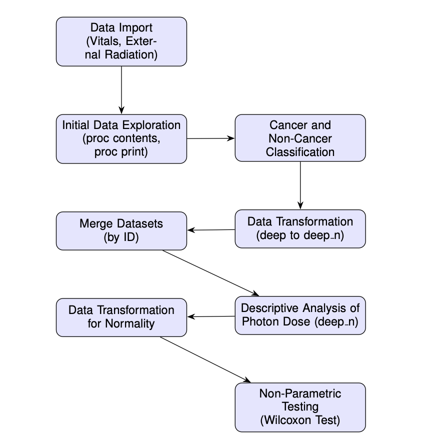
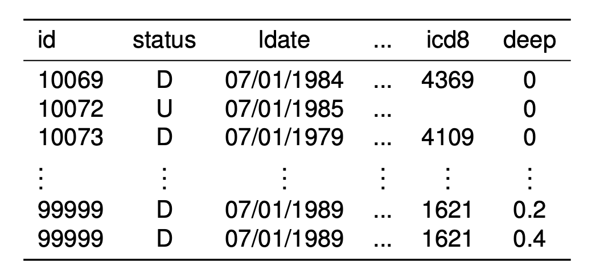
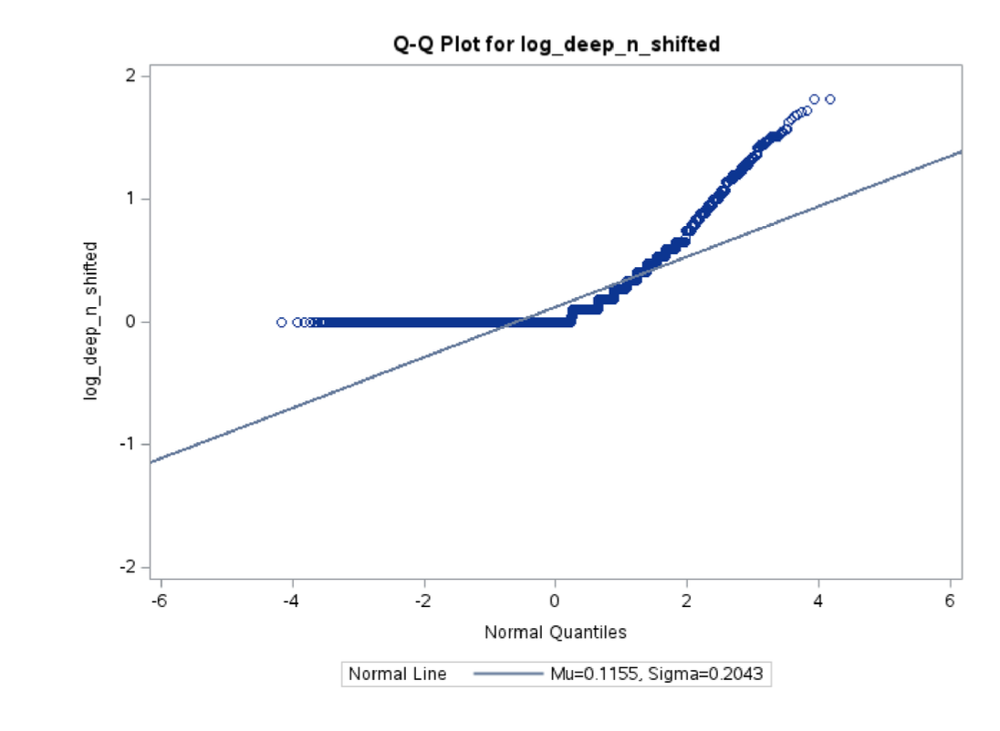

# 🧪 Analyzing the Impact of Occupational Radiation Exposure on Cancer Mortality  

## 1. Introduction: The Shadow of Radiation ☢️  

Occupational radiation exposure is a significant public health concern, particularly for workers in industries like nuclear power, metal processing, and energy production. Long-term exposure to radiation has been linked to increased cancer risks, making this an important area of occupational health research.  

The Fernald Feed Materials Production Center (FMPC) in Fernald, Ohio—a uranium processing facility operational between 1951 and 1989—serves as the backdrop for this study. FMPC released significant uranium dust into the atmosphere, contaminating its surroundings and posing a severe health risk to workers.  

## 2. Objective
This retrospective study investigates the impact of occupational radiation exposure on cancer mortality among white male workers at FMPC. By analyzing mortality patterns and radiation exposure data, we aim to uncover:  
- The relationship between radiation doses and cancer-related deaths.  
- Statistical evidence of differences in exposure between cancerous and non-cancerous groups.  

## 3. Methods and Materials 🛠️  

### A. Data Sources 📊  

Two datasets were analyzed:  

1. Vital Dataset:  
   - Contains demographic and mortality details for workers employed at FMPC from 1951–1989.  
   - Key variables: birth dates, job titles, employment history, and cause of death (ICDA classification).  

2. External Radiation Dataset:  
   - Contains annual radiation doses (measured in cGy) for FMPC employees.  
   - Monitoring frequency: Weekly for high-risk groups, biweekly/monthly for others.  
   - Internal radiation exposure was also estimated using lung counts and urinalyses.  

Note: The study focuses on white male workers due to demographic consistency, reducing variability in the analysis.  

### B. Workflow of the Study 🔄  

The data analysis process followed a systematic workflow as shown below:  

### C. Data Preprocessing 🧹  

1. Cancer Classification:  
   Workers were categorized into two groups based on ICD-8 codes:  
   - Cancerous: Codes 140–209 (cancer-related).  
   - Non-Cancerous: All other causes of death.  

2. Data Merging:  
   The Vital Dataset and External Radiation Dataset were merged using a common ID column.  

Table 1: Example Rows from Merged Dataset  

### D. Statistical Analysis 🧮  

1. Descriptive Statistics:  
   Calculated measures like mean, standard deviation, skewness, and kurtosis for photon dose levels.  

2. Data Transformation:  
   - A Box-Cox transformation was applied to normalize photon dose data.  
   - Despite transformations, the data remained non-normal (Kolmogorov-Smirnov test, \( p < 0.01 \)).  

3. Wilcoxon Rank-Sum Test:  
   A non-parametric test was conducted to compare photon dose levels between cancerous and non-cancerous groups.  

## 4. Results 📈  

### A. Descriptive Analysis  

Descriptive statistics for photon dose levels in cancer-related deaths are summarized below:  

Table 2: Descriptive Statistics for Cancer Group (Photon Dose)  

| Statistic      | Value       |  
|--|--|  
| N                  | 39,368          |  
| Mean (cGy)         | 0.151           |  
| Std. Deviation     | 0.321           |  
| Skewness           | 4.337           |  
| Kurtosis           | 29.104          |  

- The distribution of photon dose was highly skewed, with extreme values driving the mean upward.  

### B. Normality Tests  

 
- The Q-Q plot revealed deviations from normality, justifying the use of non-parametric testing.  

### C. Wilcoxon Rank-Sum Test  

The Wilcoxon test compared photon dose levels between cancerous and non-cancerous groups:  

Table 3: Wilcoxon Test Results  

 

Result: The test showed a statistically significant difference in photon dose levels:  
- \( Z = 3.4965 \), \( p < 0.0005 \).  
- Cancer-related deaths were associated with higher radiation exposure.  

## 5. Discussion: Key Insights 🧐  

1. Workers who died from cancer-related causes had significantly higher radiation doses than those who died from other causes.  
2. The skewed distribution of photon doses highlights the importance of non-parametric tests in exposure data analysis.  
3. These findings align with the hypothesis that long-term radiation exposure increases the risk of cancer mortality.  

## 6. Conclusion: What This Means for Public Health 🌍  

Our analysis suggests a strong association between occupational radiation exposure and cancer mortality among FMPC workers. These results underscore the importance of:  
1. Dose Monitoring: Implementing strict monitoring protocols for radiation levels.  
2. Safety Regulations: Ensuring safety standards to minimize exposure in occupational settings.  
3. Future Research: Conducting studies with larger, more diverse datasets to validate these findings. 

## 7. References 📚  

1. Cragle, D. L., Watkins, J. P., Ingle, J. N., et al. *Mortality Among White Male Workers at a Uranium Processing Plant.* (1996).  
2. CEDR (1994). *Fernald Retrospective Cancer Mortality Study.*  

Thank you for reading! 🚀  
*“Science is not only about understanding the world; it’s about protecting it.”*  
