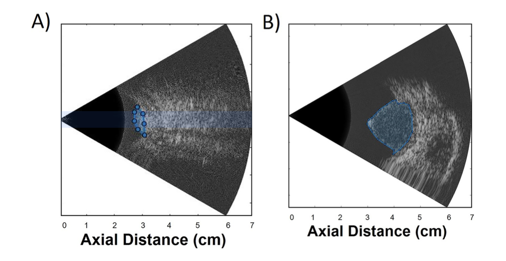
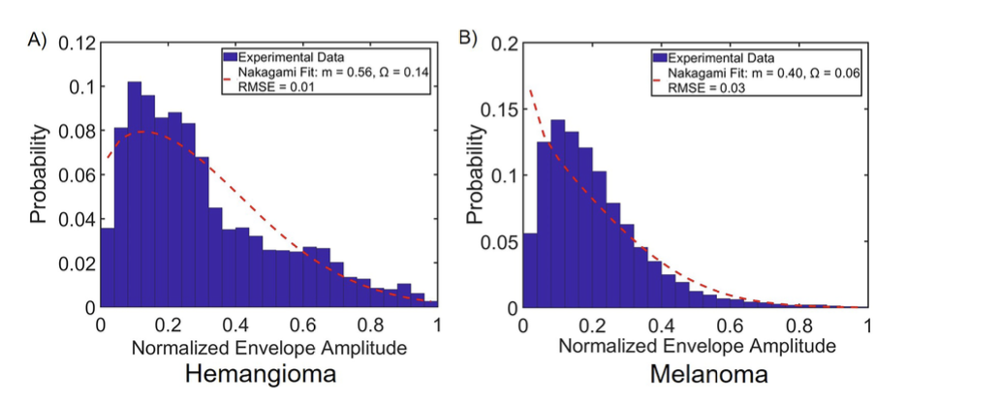
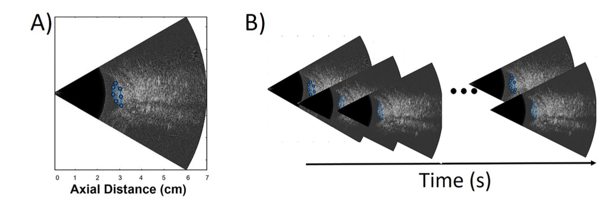
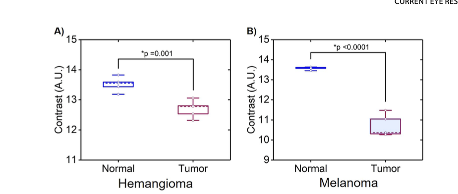

# 🩺 Ultrasound Biomarkers: Differentiating Benign and Malignant Choroidal Tumors 

Co-author of the research paper titled:  
*“Ultrasound Biomarkers: Contrast-enhanced Ultrasound and Nakagami Imaging to Differentiate Benign and Malignant Choroidal Tumors”*  
🔗 [Read the full paper here](https://www.tandfonline.com/eprint/DFGWU5WM8FZZQUWEPVAQ/full?target=10.1080/02713683.2024.2366307#d1e752)  

## Introduction: Seeing the Invisible with Ultrasound  

Choroidal tumors, especially choroidal hemangiomas (CH) and choroidal melanomas (CM), present a unique challenge in clinical diagnosis. CH is a benign, highly vascular tumor, whereas CM is the most common malignant intraocular tumor in adults.  

The question is: Can we use advanced ultrasound techniques to tell the difference?  

In this study, we used:  
1. Contrast-enhanced ultrasound (CEUS) to assess blood perfusion.  
2. Nakagami imaging to analyze tissue heterogeneity and structure.  

These techniques provide quantitative insights into the vascularity and tissue properties of choroidal tumors, offering a novel way to distinguish between benign and malignant lesions.  

## Why This Matters

Existing diagnostic techniques like A/B-scan ultrasonography, OCT, and angiography are effective but have limitations when differentiating CH from CM. False positives and negatives can occur due to:  
- Atypical tumor presentation  
- Internal hemorrhage  
- Size and shape variability  

This study explores the use of CEUS and Nakagami imaging to provide objective, quantitative biomarkers to improve accuracy in diagnosing these tumors.  

## Methods: From Microbubbles to Pixels

### 1. Patient Selection  
- 10 patients (5 with CH, 5 with CM)  
- Comprehensive clinical examination and imaging confirmed diagnosis.  
- Ultrasound imaging was conducted at L.V. Prasad Eye Institute, Hyderabad, India.

### 2. Techniques Used  

#### A. Nakagami Imaging
- Objective: Analyze tissue heterogeneity using statistical backscatter analysis.  
- Steps:  
   1. Precontrast B-scan ultrasound images were acquired.  
   2. The Nakagami distribution function was applied to the normalized ultrasound envelope.  
   3. Two parameters were extracted:  
      - m (shape parameter): Indicates tissue heterogeneity.  
      - Ω (scale parameter): Represents backscattered energy.  

The formula for Nakagami shape parameter is: 

$$
m = \frac{E[r^2]^2}{2 \cdot E[r^4] - E[r^2]^2}
$$ 

### Nakagami Scale Parameter (Ω) Formula  

The Nakagami scale parameter \( \Omega \) represents the backscattered energy of an ultrasound signal and is calculated as:  

$$
\Omega = E[r^2]
$$

Where:  
- \( r \) is the signal amplitude envelope.  
- \( E[r^2] \) is the expected value of the squared signal amplitude.

Key Insight:  
- $\Omega$ measures the total energy of the backscattered signal.  
- Higher $\Omega$ values indicate stronger backscatter, which is often observed in tissues with higher vascularity or heterogeneity.  

#### B. Contrast-enhanced Ultrasound (CEUS)  
- Objective: Evaluate microvascular perfusion within tumors.  
- Steps:  
   1. Patients received Definity® microbubble contrast agent via IV injection.  
   2. B-scan ultrasound frames were recorded 10–60 seconds post-injection.  
   3. A gradient-based contrast estimation method quantified pixel intensity changes over time.  

The formula for contrast estimation:

$$
\text{Contrast} = \frac{1}{MN} \sum_{i=1}^M \sum_{j=1}^N \frac{\Delta P_x^2 + \Delta P_y^2}{\sigma^2}
$$

Where $\Delta P_x$ and $\Delta P_y$ are pixel intensity gradients.  

## Results: Numbers Don’t Lie

### 1. Nakagami Parameters  

Here in the images tumor is our Region of Interest which is selected in blue dotted lines.

| Parameter   | CH          | CM          | p-value     |  
|--|--|--|-|  
| m (shape)   | 0.61 ± 0.20     | 0.28 ± 0.15     | 0.032 (Sig) |  
| Ω (scale)   | 0.15 ± 0.05     | 0.03 ± 0.02     | 0.0019 (Sig) |  

- Key Insight: Higher *m* and *Ω* values in CH indicate greater tissue heterogeneity and vascularity compared to CM.  

### 2. CEUS Contrast Analysis  

Figure shows reference B-scan frame before injection of the contrast agent for a CH case wherein the selected tumor region delineated in blue. A time series
of B-scan images of a CH case that were acquired 10–60 s post-injection of the contrast agent.

| **Tumor Type**    | **Time-Averaged Contrast** | **p-value**     |
|--------------------|----------------------------|------------------|
| CH                 | 13.2 ± 0.5                | 0.008 (**Sig**)  |
| CM                 | 10.8 ± 0.6                | —                |
 

Key Findings:  
- CH demonstrated higher contrast post-injection, indicating greater vascularity.  
- The normal choroidal region showed significantly higher contrast compared to tumor regions for both CH and CM.  

## Discussion: What This Means  

### Nakagami Imaging  
- CH is more heterogeneous due to higher vascular density and enlarged, thin-walled blood vessels.  
- CM, being more homogeneous, showed lower heterogeneity and backscattered energy.  

### CEUS Analysis  
- CH demonstrated stronger contrast enhancement, confirming its hypervascular nature.  
- CM’s lower contrast correlates with thicker, mature vessels and slower blood flow velocity.  

## Conclusion: A Step Forward in Choroidal Tumor Diagnosis 

This study demonstrates that Nakagami imaging and CEUS provide complementary, quantitative biomarkers to differentiate benign and malignant choroidal tumors.  

### Clinical Takeaways:  
1. Nakagami Parameters: Identify tissue heterogeneity.  
2. CEUS Contrast: Evaluate tumor vascularity.  

Together, these techniques can improve diagnostic accuracy, offering a non-invasive, objective approach for clinicians.  

## Gratitude

Special thanks to my mentors and collaborators for their valuable support and feedback throughout this project.  

Let’s keep pushing the boundaries of imaging technology to improve lives!

Thank you for reading!
*“Science is not just about seeing; it’s about understanding what we see.”*  
